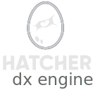
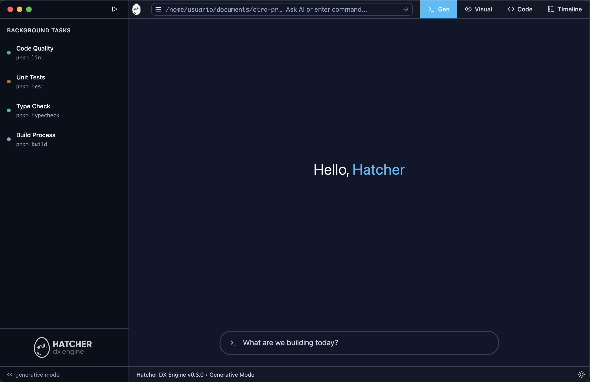

  <details>
    <summary></summary>
    <h1>Hatcher: The DX Engine</h1>
  </details>
<br><br><br>
<p align="center">
  <picture>
    <source media="(prefers-color-scheme: dark)" srcset="./.github/assets/logo-dark.svg">
    <source media="(prefers-color-scheme: light)" srcset="./.github/assets/logo-light.svg">
    
  </picture>
</p>

<p align="center">
  <strong>The IDE for builders who ship.</strong>
  <br /><br />
  <a href="ROADMAP.md"></a>
  <a href="LICENSE.md"></a>
  
  <a href="CONTRIBUTING.md"></a>
  <br />
  <a href="https://twitter.com/HatcherDX"></a>
  <a href="https://discord.gg/cZ7PZvnMk4"></a>
  <a href="https://github.com/HatcherDX/dx-engine"></a>
  <br />
  <a href="#supported-platforms"></a>
  <a href="#supported-platforms"></a>
  <a href="#supported-platforms"></a>
</p>
<br>

<p align="center">
  
</p>

<br>

## The Vision: Controlled Amplification

Software development is at an inflection point. While AI can generate 80% of an application's code, developers are left frustrated in the "last mile" of fine-tuning, debugging, and aligning the output with existing patterns. This is due to a fundamental loss of deterministic control.

**Hatcher** is an open-source, **Next-Generation IDE** designed to be the definitive "Constitutional IDE" for the AI era. This control interface is the heart of our intelligence layer, which we call `//hatche.rs`. It's designed to compose and orchestrate powerful AI models (like Claude and Gemini), turning them into reliable, peer-level contributors. Our philosophy is "Controlled Amplification": the developer remains the surgeon, using Hatcher to wield AI as a high-precision scalpel.

## The Problem We Solve

Hatcher is built to eliminate the friction that AI introduces, transforming a frustrating cycle of trial-and-error into a fluid, intuitive workflow.

- **Stop Describing. Start Pointing:** Bridge the gap between your live application and source code with the Visual-to-Code bridge.
- **Your AI Forgets. Ours Remembers:** Replace static context files with dynamic Team Playbooks that provide the right architectural rules at the right time.
- **No More Black Boxes. Just Power:** Maintain deterministic command over AI with visual diffs, **configurable quality pipelines**, and automated testing.

## Project Status: Alpha

Hatcher is currently in a very early stage of development, but it's built on a robust foundation. The core `Visual-to-Code` technology has been validated in a private proof-of-concept, and key infrastructure, like our integrated terminal, is architected for performance and reliability, matching the professional-grade experience of industry leaders like VSCode. We are now building the foundational MVP.

We are building in public and welcome the community to join us on this journey. Expect bugs, rapid changes, and an open conversation about the future of development.

Uses:

- Vue.js
- Typescript
- Turborepo
- Vite (for Electron builds)

### Hatcher Manifesto: From Vision to Execution

We believe in pairing a bold vision with relentless execution. This is a living document tracking our journey as we build the future of development.

#### ✅ **Foundation: Validated & World-Class**

- **10/10 World-Class Terminal:**
  - _A native, GPU-accelerated terminal that demonstrably surpasses industry standards (like VSCode's) in performance and resource efficiency, validated against our internal `Context7` benchmarks._

- **Robust, High-Performance Git Engine:**
  - _A foundational Git implementation architected for the speed and reliability required by complex, large-scale monorepos._

#### 🟡 **In Active Development: The Next Frontier**

- **Hybrid AI Architecture:**
  - _The blueprint is complete, and we are now actively integrating our first lightweight, local LLMs. This core innovation will bring instant, private AI feedback directly into the editor, forming the bedrock of Hatcher's intelligence._

#### 🚀 **Future Conquests: The Road Ahead**

- **Team Playbooks & "Corporate Constitutions":**
  - _Our ultimate solution to the AI context problem. A versionable, governable system for teams to encode their architectural patterns and best practices, ensuring AI-generated code is always aligned with their unique standards._

_For more details on each item and future plans, see our full **[Project Roadmap](ROADMAP.md)**._

### Our Architecture: AI for Intent, Determinism for Quality

While many tools treat AI as a black box that produces unreliable code, Hatcher is built on a hybrid architectural principle. We believe in using the right tool for the right job:

- **AI for Intent:** We leverage state-of-the-art AI to perform creative, complex tasks that require understanding natural language and user intent.
- **Determinism for Quality:** That AI output is then immediately fed into a rigorous and configurable **Quality Pipeline** of battle-tested, deterministic tools.

This pipeline ensures every piece of AI-generated code is not just creative, but also robust, reliable, and compliant with professional standards before the developer ever sees it. This is "Controlled Amplification" in action.

## Supported Platforms

For our initial MVP, Hatcher's primary development and testing focus is on **macOS** and **Linux**. As an independent open-source project, we are prioritizing the environments most common among our target users and where we can ensure a first-class, stable experience through automated testing.

Hatcher for Linux is officially built and validated for both **`x86_64`** (Intel/AMD) and **`aarch64`** (ARM) architectures. Our automated test suite runs on the latest Ubuntu LTS release, and the application is expected to work on most modern Debian-based distributions.

While the application may also run on Windows, we currently lack the dedicated hardware and resources to provide official support. We believe that robust Windows support is a significant business opportunity. We are open to strategic partnerships, sponsorships, or direct support from organizations like Microsoft to fund a dedicated team and the necessary licenses to make Hatcher a premier, fully-supported IDE on the Windows platform.

## More Than an IDE: Your Productivity Anchor

Hatcher isn't just another AI-powered editor. It's designed as your **productivity anchor** – a command center that protects your flow state from the relentless stream of digital distractions that plague modern development.

Every design choice, from our intentionally bold interface to our focused feature set, serves a single purpose: **minimizing cognitive friction**. When Slack notifications pull your attention, when emails demand immediate response, when the chaos of modern work threatens to fragment your focus – Hatcher acts as a visual beacon, instantly reconnecting you to your code and your flow.

We believe that in an attention-fractured world, the most revolutionary IDE isn't the one with the most features – it's the one that helps you remember what truly matters: **the code, the problem, and the elegant solution waiting to emerge**.

## Getting Started

The first alpha version of Hatcher is scheduled for release soon. The easiest way to get started will be to download the official release for your operating system from our **[GitHub Releases](https://github.com/HatcherDX/dx-engine/releases)** page. Stay tuned!

### Prerequisites

**Important:** This project requires Node.js 22 or higher and uses node-pty v1.1.0-beta34 for terminal functionality.

#### Node.js 22 Setup

##### Option 1: Using nvm (Recommended)

```bash
# Install nvm if you don't have it
curl -o- https://raw.githubusercontent.com/nvm-sh/nvm/v0.39.7/install.sh | bash

# Restart your terminal or run:
source ~/.zshrc

# Install and use Node.js 22
nvm install 22
nvm use 22
nvm alias default 22
```

##### Option 2: Automatic Setup Script

```bash
# Run our setup script to configure Node.js 22 automatically
./scripts/setup-node.sh
```

#### Dependencies

After setting up Node.js 22, install dependencies:

```bash
pnpm install
```

**Note:** If you encounter terminal issues, the project automatically uses node-pty v1.1.0-beta34 which is compatible with modern Electron versions.

### Environment Variables

This project uses `.env` files for environment variables. After running `pnpm install`, a `postinstall` script will automatically create the necessary `.env` files from their `.env.example` counterparts. You can customize these files with your own settings, but they will be ignored by Git.

```bash
pnpm install
pnpm run dev
```

### Build

```bash
pnpm build
```

### Pack App (Dev)

```bash
pnpm pack:dev
```

### Pack App (Prod)

```bash
pnpm pack:prod
```

## Contributing

We believe the future of development tools will be built by the community. If you are passionate about developer experience and the future of AI, we would love your help.

Please read our **[CONTRIBUTING.md](CONTRIBUTING.md)** to learn how you can get involved, from reporting bugs to submitting your first pull request.

## Our Open-Core Philosophy

Hatcher is and always will be an open-core project. We are committed to building a powerful, free, and open-source tool for individual developers. Our core mission is to empower the community.

Our commercial strategy is focused on providing features for professional teams and enterprises. Paid offerings, such as advanced "Team Playbooks", centralized governance, and premium support, are what will fund the continuous development and innovation of the free, core product that everyone can use.

This model allows us to build a sustainable business while staying true to our open-source roots.

## About the Author

Hatcher is created by **Chriss Mejía**, a Principal AI Systems Architect & Founder with over 22 years of experience building complex platforms for companies ranging from early-stage YC startups to large-scale enterprises.

This project is the culmination of years of R&D, born from his deep belief that the future of software lies in amplifying, not replacing, human intuition.

## License

Copyright (c) 2025 Chriss Mejía. This project is licensed under the **[MIT License](LICENSE.md)**.
