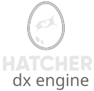
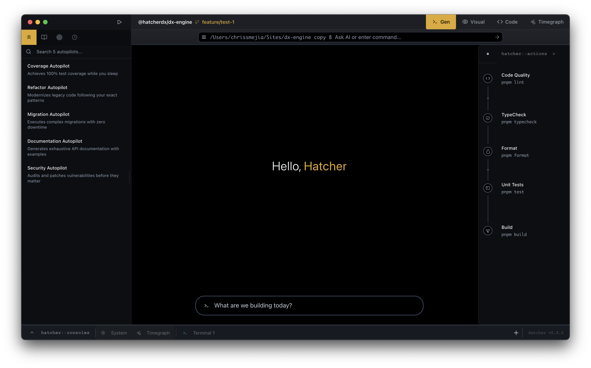

  <details>
    <summary></summary>
    <h1>Hatcher: The Command Deck for the AI Era.</h1>
  </details>
<br><br><br>

<p align="center">
  <picture>
    <source media="(prefers-color-scheme: dark)" srcset="./.github/assets/logo-dark.svg">
    <source media="(prefers-color-scheme: light)" srcset="./.github/assets/logo-light.svg">
    
  </picture>
</p>

<p align="center">
  <em>The Command Deck for the Software Artisan.</em>
</p>

<p align="center">
  <a href="#-project-status-alpha"></a>
  <a href="LICENSE.md"></a>
  
  <a href="CONTRIBUTING.md"></a>
  <br />
  <a href="#supported-platforms"></a>
  <a href="#supported-platforms"></a>
  <a href="#supported-platforms"></a>
  <br /><br />
  <a href="https://twitter.com/HatcherDX"><strong>Follow on X</strong></a>
  ·
  <a href="https://discord.gg/cZ7PZvnMk4"><strong>Join our Discord</strong></a>
  ·
  <a href="https://github.com/HatcherDX/dx-engine"><strong>Star on GitHub</strong></a>
</p>
<br>

<p align="center">
  
</p>

<br>

## The Mission: Beyond the Magic Prompt

The industry is chasing a dangerous fantasy: the myth of the "perfect prompt"—the idea that mission-critical software can be built by an AI that perfectly understands a single command. This is the idea that complex, mission-critical software can be built by a magic AI that perfectly understands a single, vague command. This isn't just wrong; it's a betrayal of the craft of software engineering. It produces chaotic, insecure, and unmaintainable code.

**Hatcher is the counter-narrative.** We believe the future doesn't belong to those who replace the artisan with an oracle, but to those who empower the artisan with a **Command Deck:**. As an open-source "**Constitutional IDE**," Hatcher puts the developer back in the Commander's chair.

### Our philosophy is Controlled Amplification:

**The Artisan is the Commander**: You provide the strategy and judgment.

**The AI is the Fleet**: A set of powerful, obedient, and auditable tools that execute your commands.

**The IDE is the Command Deck**: The unified interface for total control and visibility.

### From Co-Pilot to Auto-Pilot

Today's AI tools are excellent co-pilots; they assist you as you type.

**Hatcher is the first Auto-Pilot for software development.**

Using executable **Playbooks**, Hatcher can run complex development missions—like achieving 100% test coverage on a module—autonomously, even while you sleep. You remain the Commander, defining the flight plan and giving the final approval. We're moving from tactical assistance to strategic automation.

**Hatcher is the counter-narrative.** We believe the future doesn't belong to those who replace the artisan with an oracle, but to those who empower the artisan with a **Command Deck.**

**Hatcher** is an open-source "**Constitutional IDE**" that puts the developer back in the Commander's chair. Our philosophy is Controlled Amplification: the artisan remains the strategic agent, using AI not as a replacement, but as a fleet of powerful, obedient, and auditable drones.

## The Hatcher Arsenal

Our philosophy is manifested in the systems that power the Command Deck.

- **🚀 Autopilots & Playbooks:** While others chase the perfect prompt, we perfect the process. Hatcher gives you a fleet of Autopilots that execute complex missions by following Playbooks—the flight plans you design. It's your wisdom, codified into immortal automation.

- **🗺️ Time Graph:** A single prompt has no history. A professional workflow has a rich one. The Hatcher Time Graph is your star chart, a quantum map of your mission's history. It is the architecture that makes our Persistent State Engine a reality, eliminating AI amnesia. Powered by our custom Git Engine and WebGL visualization, it provides interactive commit graphs, side-by-side diff comparison, and timeline playback—all rendered at 60 FPS for repositories of any size.

- **🔧 The Universal Fabricator:** The "magic prompt" ignores your legacy. We honor it. The Fabricator runs polyglot "local lambdas" via WebAssembly, allowing you to integrate battle-tested components from Delphi, C++, Rust, and more into your modern starships.

- **🛡️ The Shield Grid: "Magic AI"** "Magic AI" is often built on insecure foundations. Ours is a fortress. We forge Hatcher's core in Rust, build our own enterprise-grade infrastructure, and secure your work in a local-first, **end-to-end encrypted vault**.

## One Command Deck, Two Mission Types

Hatcher is a single, unified IDE that intelligently adapts to your project's needs, offering two distinct configurations:

🏛️ **Hatcher Generative: The Explorer-Class Vessel**
For missions of rapid innovation and prototyping. This configuration gives you the full power of your AI fleet with the absolute safety net of the Time Graph.

🥚 **Hatcher EGGs: The Dreadnought-Class Vessel**
For mission-critical systems. An EGG (**E**nforced **G**overnance **G**uardrails) transforms the command deck into a hyper-deterministic "War Room" for regulated and high-stakes deployments, built on the secure chassis of Tauri + Rust.

## The Hatcher Arsenal: The Workshops and The Engine

Hatcher's architecture is composed of two main layers: the HATs, which are the specialized workshops where you perform your craft, and the Automation Engine, which works for you in the background.

### The Core HATs (The Workshops)

A developer "wears different hats" throughout the day. Hatcher gives you a dedicated HAT, or workspace, for every job. These are our foundational HATs:

- `</> The Code HAT:` A world-class code editor, powered by Monaco, for when you are in the flow of pure creation.

- `✨ The Gen HAT:` The prompt engineering interface. Your direct line of communication to the AI fleet.

- `🎨 The Visual HAT:` A workspace for designing and interacting with UI components, bridging the gap between design and code.

- `⏱️ The Time Graph HAT:` The ultimate audit tool. A quantum graph of your project's history to visualize and understand every change.

### The Automation Engine (Playbooks & Autopilot)

This is the engine that powers the Autopilot. It operates across all HATs and is composed of two core features:

Playbooks: The "flight plans" for your Autopilot. Codify your expert workflows into executable scripts that the AI can follow to perform complex, multi-step tasks.

Hatcher Actions: The "quality gates." A hyper-local CI/CD pipeline that validates every change (from human or AI) against your project's constitution, ensuring nothing breaks.

## ‍🔬 Enterprise-Grade Foundations: The Proof of Our Promise

A vision this ambitious requires an unwavering commitment to engineering excellence. We don't just assemble off-the-shelf components; **we build our own world-class infrastructure** to guarantee a premium, reliable experience. This is our promise of quality, made tangible:

- **A 10/10 Terminal**: Our GPU-accelerated terminal is engineered from the ground up for unmatched performance and reliability. Powered by our Shared Rendering Engine, it delivers 60 FPS rendering even with 10,000+ lines of output.

- **A Custom Git Engine**: We built our own Git engine to enable the deep, granular control required by the Time Graph. Its WebGL-powered visualization (via Shared Rendering Engine) handles massive repositories with 1000+ commits using advanced LOD optimizations.

- **A Secure Storage Engine**: Every piece of data is handled with security as a first principle, featuring AES-256-GCM encryption, Argon2id key derivation, and cross-platform keychain integration.

- **A Shared Rendering Engine**: Our WebGL-accelerated rendering infrastructure (`@hatcherdx/shared-rendering`) powers both Terminal and Git visualization. Built on THREE.js, it leverages instanced rendering, texture atlases, and custom GLSL shaders to deliver desktop-class performance for text rendering, commit graphs, and side-by-side diff visualization.

This "luxury scaffolding" is the foundation upon which every feature is built. It's how we ensure that Hatcher isn't just a powerful idea, but a rock-solid, enterprise-ready platform.

## 🏛️ Project Status: Alpha

Hatcher is in active development. We have architected the full vision and are now implementing the core HATs.

| Mode                   | Status                        | Next Steps                                                                                                   |
| :--------------------- | :---------------------------- | :----------------------------------------------------------------------------------------------------------- |
| **The Code HAT**       | 🏗️ **Functional Foundations** | The file explorer and interactive terminal are fully functional. Next: integrating the Monaco code editor.   |
| **The Time Graph HAT** | 🏗️ **Functional Foundations** | The visualization layer is operative. Next: connecting write actions (`commit`, `push`) from our Git engine. |
| **The Visual HAT**     | 🏛️ **Architectural Preview**  | The UI scaffolding is in place, ready for the Visual-to-Code bridge implementation.                          |
| **The Gen HAT**        | 🏛️ **Architectural Preview**  | The UI is ready for the integration of the first AI model.                                                   |

_For more details, see our full **[Project Roadmap](ROADMAP.md)**._

## 🦀 Architectural Vision: The Path to Rust

Our current architecture is built on **Electron**, a strategic choice that provides a robust, battle-tested foundation. It allows us to deliver a reliable cross-platform experience and rapidly innovate on Hatcher's core value proposition.

This stable foundation is our launchpad.

Our long-term vision is to forge Hatcher's core in **Rust**, leveraging its unparalleled performance and memory safety. The goal is to migrate the proven, battle-tested logic from our Electron prototype into a next-generation engine that is lighter, faster, and even more secure.

**This is where you come in.** We are actively seeking contributors with experience in systems programming, performance optimization, and architectural design to help us chart this course. This is a unique opportunity to shape the future of a foundational development tool.

## Supported Platforms

Hatcher is engineered for **uncompromising cross-platform reliability.** Our sophisticated hybrid testing strategy and multi-job CI/CD pipeline guarantee that every critical component is rigorously validated on **macOS, Linux, and Windows** with every commit.

_We currently offer experimental **Nightly Builds** for all platforms. As we approach our v1.0, we will begin publishing official, stable releases._

## Our Open Core Pact

Hatcher is and always will be an open-core project. **The core IDE, for local, individual use, will always be free and MIT-licensed.**

Our commercial strategy is focused on providing optional, premium cloud services for teams and enabling the **EGG Enterprise** configuration for large-scale deployments.

## Getting Involved

Hatcher is being built in the open, and the best way to get started today is by becoming a contributor. We are actively seeking developers to help us forge our high-performance Rust core and shape the future of this platform.

While an official alpha release for end-users is on the horizon, developers can clone the repository and run the latest nightly build today. Please read our **[CONTRIBUTING.md](CONTRIBUTING.md)** for guidelines and see the setup instructions below.

<details>
<summary><strong>Click here for Developer Setup Instructions</strong></summary>

### Prerequisites

**Important:** This project requires Node.js 22 or higher and uses node-pty v1.1.0-beta34 for terminal functionality.

#### Node.js 22 Setup

##### Option 1: Using nvm (Recommended)

```bash
# Install nvm if you don't have it
curl -o- https://raw.githubusercontent.com/nvm-sh/nvm/v0.39.7/install.sh | bash

# Restart your terminal or run:
source ~/.zshrc

# Install and use Node.js 22
nvm install 22
nvm use 22
nvm alias default 22
```

##### Option 2: Automatic Setup Script

```bash
# Run our setup script to configure Node.js 22 automatically
./scripts/setup-node.sh
```

#### Dependencies

After setting up Node.js 22, install dependencies:

```bash
pnpm install
```

**Note:** If you encounter terminal issues, the project automatically uses node-pty v1.1.0-beta34 which is compatible with modern Electron versions.

### Environment Variables

This project uses `.env` files for environment variables. After running `pnpm install`, a `postinstall` script will automatically create the necessary `.env` files from their `.env.example` counterparts. You can customize these files with your own settings, but they will be ignored by Git.

```bash
pnpm install
pnpm run dev
```

### Build

```bash
pnpm build
```

### Pack App (Dev)

```bash
pnpm pack:dev
```

### Pack App (Prod)

```bash
pnpm pack:prod
```

</details>

## About the Admiral

Hatcher is created by **Chriss Mejía**, a Principal AI Systems Architect & Founder with over 22 years of experience building complex platforms for companies ranging from early-stage YC startups to large-scale enterprises.

This project is the culmination of years of R&D, born from his deep belief that the future of software lies in amplifying, not replacing, human intuition.

## Licensing

The source code for the Hatcher DX Engine is licensed under the **MIT License**. You can find the full license text in the **[MIT License](LICENSE.md)** file.

Please note that the MIT License **does not** apply to the Hatcher brand assets. The Hatcher name and all related logos and icons are **All Rights Reserved**. For questions regarding the use of our brand, please contact us at chriss@hatche.rs.
