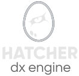

  

    

    <h1>Hatcher: The DX Engine</h1>
  

   

  <picture>
    <source media="(prefers-color-scheme: dark)" srcset="./.github/assets/logo-dark.svg">
    <source media="(prefers-color-scheme: light)" srcset="./.github/assets/logo-light.svg">
    
  </picture>

  <strong>The IDE for builders who ship.</strong>
    
  
  
  
  

   

## The Vision: Controlled Amplification

Software development is at an inflection point. While AI can generate 80% of an application's code, developers are left frustrated in the "last mile" of fine-tuning, debugging, and aligning the output with existing patterns. This is due to a fundamental loss of deterministic control.

**Hatcher** is an open-source IDE designed to conquer the full "0-to-100" workflow. It acts as the definitive **deterministic control interface** for powerful AI engines like Claude Code and Gemini CLI. We call our philosophy "Controlled Amplification": the developer remains the surgeon, using Hatcher to wield AI as a high-precision scalpel.

## The Problem We Solve

Hatcher is built to eliminate the friction that AI introduces, transforming a frustrating cycle of trial-and-error into a fluid, intuitive workflow. We do this by solving three core problems:

* **The Visual Disconnect:** We bridge the gap between your live, rendered application and the source code. Instead of describing a visual change, you simply point to it.
* **The Context Void:** We replace static context files with a dynamic, centralized system of "Playbooks" that provides the AI with the right rules at the right time.
* **The Loss of Control:** We provide a suite of tools, from automated test loops to visual diffs, that ensure the developer is always in command of the final output.

## Project Status: Alpha

Hatcher is currently in a very early stage of development. The core `Visual-to-Code` technology has been validated in a private proof-of-concept, and we are now building the foundational MVP.

We are building in public and welcome the community to join us on this journey. Expect bugs, rapid changes, and an open conversation about the future of development.

## Getting Started

_[This section will be filled out once the first installable version is ready. It will contain clear, step-by-step instructions for downloading and running the Hatcher MVP.]_

1.  `git clone https://github.com/HatcherDX/dx-engine.git`
2.  `npm install`
3.  `npm start`

## Roadmap

Our vision is ambitious. We're starting with the core "fine-tuning" workflow, but our roadmap includes building a full "0-to-100" experience.

* ✅ **Core Innovation:** Visual-to-Code Sync (AST-based)
* ➡️ **Next Up:** Integrated Git & Automated Test-Correction Loops
* 🚀 **Future:** The "Corporate Constitutions" / Team Playbooks System
* 🌌 **Long Term:** The Open-Source Workflow Marketplace

*For more details on each item and future plans, see our full **[Project Roadmap](ROADMAP.md)**.*

## Contributing

We believe the future of development tools will be built by the community. If you are passionate about developer experience and the future of AI, we would love your help.

Please read our **[CONTRIBUTING.md](CONTRIBUTING.md)** to learn how you can get involved, from reporting bugs to submitting your first pull request.

## License

Copyright (c) 2025 Chriss Mejía. This project is licensed under the **[MIT License](LICENSE.md)**.