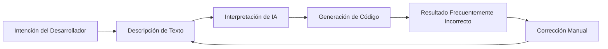
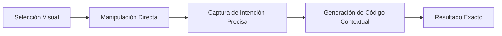

# Puente Visual-a-Código

El Puente Visual-a-Código es la característica distintiva de Hatcher que revoluciona cómo los desarrolladores interactúan con asistentes de codificación de IA. En lugar de describir cambios en texto, manipulas directamente la interfaz visual de tu aplicación, y Hatcher traduce tus acciones en modificaciones de código precisas.

## Cómo Funciona

### El Problema Tradicional

**Ejemplo del ciclo frustrante:**

- Desarrollador: "Haz el encabezado azul y centralo"
- IA: Genera CSS que hace azul el elemento incorrecto
- Desarrollador: "No, el encabezado principal, no el encabezado de la barra lateral"
- IA: Lo hace del tono azul incorrecto
- Desarrollador: "Hazlo #3B82F6 y también aumenta el tamaño de fuente"
- ... y así sucesivamente

### Enfoque Visual-a-Código de Hatcher

**Cómo funciona realmente:**

1. **Hacer Clic y Seleccionar**: Apunta al elemento que quieres cambiar
2. **Manipulación Visual**: Arrastra, redimensiona o modifica propiedades visualmente
3. **Reconocimiento de Intención**: Hatcher entiende exactamente qué cambió
4. **Generación de Código**: La IA genera el código preciso necesario
5. **Resultado Perfecto**: El cambio coincide exactamente con tu intención visual

## Características Principales

### 1. Selección de Elementos

**Sistema de Selección Inteligente**

- Selección precisa de elementos DOM
- Resaltado de elementos en hover
- Selección múltiple para cambios en lote
- Selección de componentes completos

### 2. Manipulación Visual Directa

**Controles Intuitivos**

- Arrastrar para reposicionar elementos
- Redimensionar con manijas visuales
- Edición de texto en línea
- Selección de colores visual

### 3. Generación de Código Contextual

**IA Consciente del Contexto**

- Entiende tu framework (Vue, React, etc.)
- Respeta patrones de código existentes
- Genera código idiomático
- Mantiene consistencia de estilo

## Casos de Uso

### Desarrollo de UI

- Ajustar espaciado y márgenes
- Cambiar colores y tipografía
- Reorganizar layouts
- Crear variaciones de componentes

### Diseño Responsivo

- Ajustar breakpoints visualmente
- Modificar layouts para móvil
- Optimizar para diferentes pantallas

### Refinamiento de Componentes

- Perfeccionar estados hover/focus
- Ajustar animaciones
- Optimizar accesibilidad

Esta característica elimina la barrera entre diseño y código, permitiendo un desarrollo más intuitivo y eficiente.
