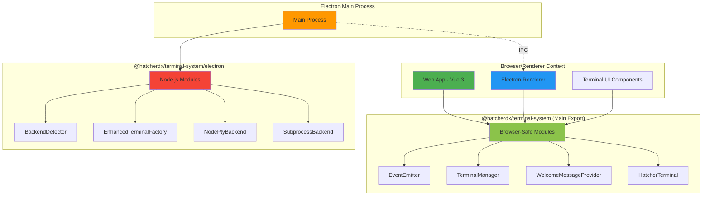

# Terminal System Architecture - Electron/Browser Separation

## Overview

The `@hatcherdx/terminal-system` package implements a strict separation between browser-safe modules and Electron-specific modules that require Node.js APIs. This architecture ensures proper Electron security model compliance with context isolation.

## Module Export Strategy

### Main Export (Browser-Safe)

**Path:** `@hatcherdx/terminal-system`
**File:** `src/index.ts`

These modules are safe to use in browser contexts and Electron renderer processes:

- **Core Components**
  - `EventEmitter` - Event handling
  - `IPCBridge` - IPC communication abstraction
  - `ProcessManager` - Process lifecycle management
  - `TerminalManager` - Terminal instance management

- **UI Components**
  - `TabManager`, `TerminalInstance`, `TerminalUI` - VSCode-style multi-tab terminal
  - `WebGLTerminalAdapter` - WebGL rendering for terminals
  - `HatcherTerminal` - Production-ready terminal component

- **Utilities**
  - `WelcomeMessageProvider` - Terminal welcome messages
  - `TerminalReadyDetector` - Terminal initialization detection
  - `TerminalEchoHandler` - Echo handling for terminal input
  - `Logger` - Logging utilities
  - `PlatformUtils` - Platform detection utilities
  - `TerminalFocusManager` - Focus management

### Electron-Specific Export

**Path:** `@hatcherdx/terminal-system/electron`
**File:** `src/electron.ts`

These modules use Node.js APIs and MUST ONLY be imported in Electron's main process:

- **Backend Implementations**
  - `BackendDetector` - Uses `child_process` and `os` for backend detection
  - `EnhancedTerminalFactory` - Factory with automatic backend detection
  - `NodePtyBackend` - Uses `node-pty` native bindings
  - `SubprocessBackend` - Uses `child_process` for process spawning
  - `SimpleSubprocessBackend` - Simplified `child_process` implementation
  - `TerminalBackend` - Base class for Node.js backends

## Architecture Diagram



## Import Examples

### ✅ Correct Usage

**In Electron Main Process:**

```typescript
// Electron main process can use Node.js modules
import {
  BackendDetector,
  EnhancedTerminalFactory,
} from '@hatcherdx/terminal-system/electron'

import { WelcomeMessageProvider } from '@hatcherdx/terminal-system'
```

**In Browser/Renderer:**

```typescript
// Browser and renderer can only use safe modules
import {
  TerminalManager,
  WelcomeMessageProvider,
  HatcherTerminal,
} from '@hatcherdx/terminal-system'
```

### ❌ Incorrect Usage

**In Browser/Renderer:**

```typescript
// ❌ WILL FAIL - Node.js modules not available in browser
import { BackendDetector } from '@hatcherdx/terminal-system/electron'

// ❌ WAS FAILING - These are no longer exported from main
import { SubprocessBackend } from '@hatcherdx/terminal-system'
```

## Security Considerations

### Context Isolation

- Node.js APIs are NEVER exposed to renderer processes
- All Node.js operations happen in the main process
- Communication happens through secure IPC channels

### Module Boundaries

- The main export (`index.ts`) contains NO Node.js imports
- The electron export (`electron.ts`) is explicitly marked for main process only
- TypeScript types help enforce these boundaries at compile time

## Migration Guide

If you have existing code importing Node.js modules from the main export:

1. **Identify Node.js module imports:**

   ```typescript
   // Old (broken in browser)
   import { BackendDetector } from '@hatcherdx/terminal-system'
   ```

2. **Update to electron-specific import:**

   ```typescript
   // New (main process only)
   import { BackendDetector } from '@hatcherdx/terminal-system/electron'
   ```

3. **Ensure code runs in correct context:**
   - Move Node.js-dependent code to Electron main process
   - Use IPC to communicate with renderer process

## Testing Strategy

### Browser Compatibility Tests

- Ensure main export loads without errors in browser environment
- Verify no Node.js API calls in browser context

### Electron Integration Tests

- Test electron-specific modules in main process context
- Verify IPC communication between main and renderer

### Build Verification

```bash
# Build the package
pnpm build

# Test in browser context (should work)
vite build

# Test in Electron context (should work)
electron dist/index.js
```

## Performance Implications

### Benefits

- **Smaller bundle size** for browser builds (no Node.js polyfills)
- **Faster load times** in renderer process
- **Better tree-shaking** with clear module boundaries

### Trade-offs

- Requires explicit import path for Electron-specific modules
- Additional complexity in managing two export paths

## Future Considerations

### Potential Improvements

1. **Auto-detection of context** - Automatically select correct import based on environment
2. **Proxy pattern** - Create a proxy that delegates to correct implementation
3. **WebAssembly backend** - Browser-compatible terminal backend using WASM

### Compatibility Matrix

| Module          | Browser | Electron Renderer | Electron Main |
| --------------- | ------- | ----------------- | ------------- |
| Main Export     | ✅      | ✅                | ✅            |
| Electron Export | ❌      | ❌                | ✅            |
| Node.js APIs    | ❌      | ❌                | ✅            |
| WebGL Rendering | ✅      | ✅                | ❌            |

## References

- [Electron Context Isolation](https://www.electronjs.org/docs/latest/tutorial/context-isolation)
- [Electron Security Best Practices](https://www.electronjs.org/docs/latest/tutorial/security)
- [Node.js Module System](https://nodejs.org/api/modules.html)
